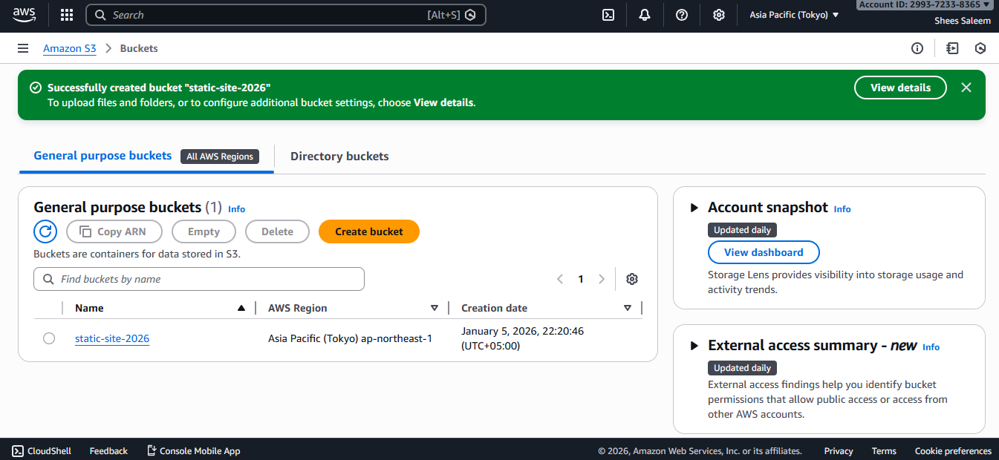
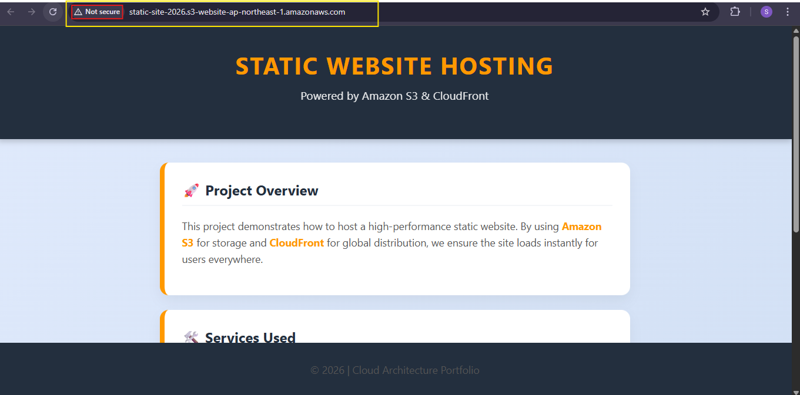

# Static Website Hosting using AWS S3 and AWS CloudFront

## Project Overview
This project demonstrates how to host a static website using **Amazon Web Services (AWS)**. 
The website is hosted on **AWS S3** and delivered globally using **AWS CloudFront** with HTTPS security.

## Objectives
- Host a static website using AWS S3
- Configure public access using AWS S3 Bucket Policy
- Use AWS CloudFront for fast and secure content delivery
- Enable HTTPS using AWS-managed TLS certificate

## AWS Services Used
- **AWS S3 (Simple Storage Service)** – Static website hosting
- **AWS CloudFront** – Content Delivery Network (CDN)

## Project Structure
- `index.html` – Main homepage
- `error.html` – Error page
- `screenshots/` – AWS screenshots

## Implementation Steps
1. Created an AWS S3 bucket
2. Uploaded HTML and CSS files to S3
3. Enabled static website hosting in AWS S3
4. Configured AWS S3 bucket policy for public access
5. Created AWS CloudFront distribution
6. Connected CloudFront with S3 origin
7. Enabled HTTPS and security settings
8. Tested website after CloudFront deployment

## Screenshots

### AWS S3 Bucket Created

### AWS S3 Static Website Hosting Enabled

### AWS S3 Bucket Policy Configuration
.png)

### Website Before AWS CloudFront (Not Secure)

### AWS CloudFront Distribution Deployed

### Website After AWS CloudFront (HTTPS Enabled)

## Result
The static website was successfully hosted on **AWS S3** and securely delivered using **AWS CloudFront** with HTTPS.

## Conclusion
This project proves how AWS services such as S3 and CloudFront can be used to build scalable, secure, and high-performance static websites.

## Author
**Shees Saleem**  
